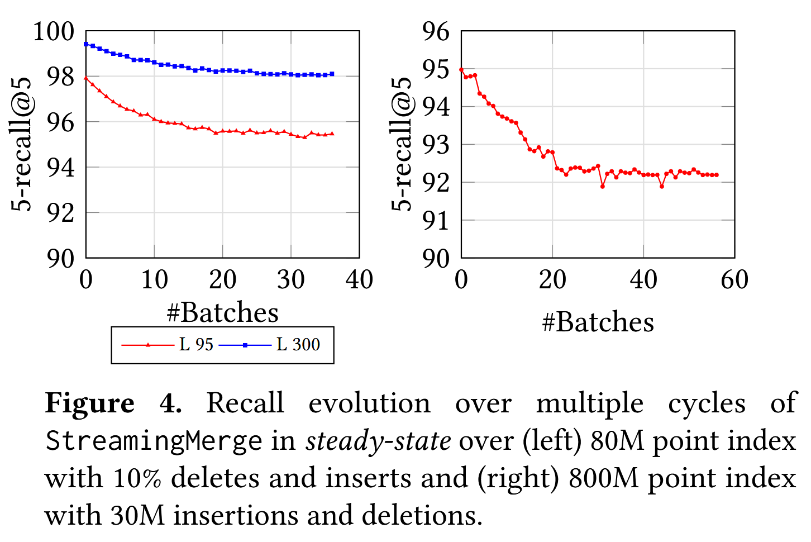
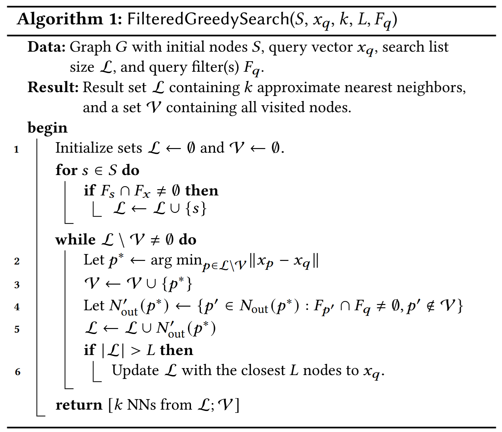
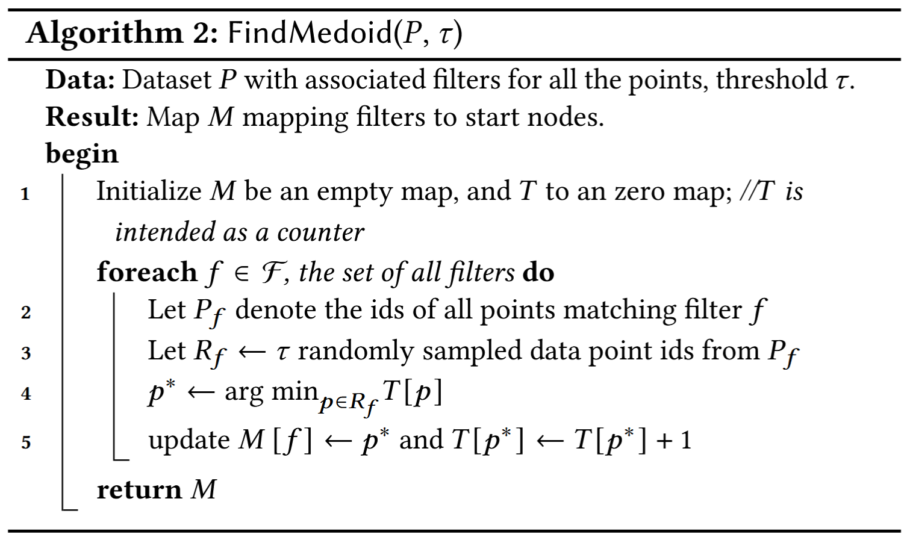
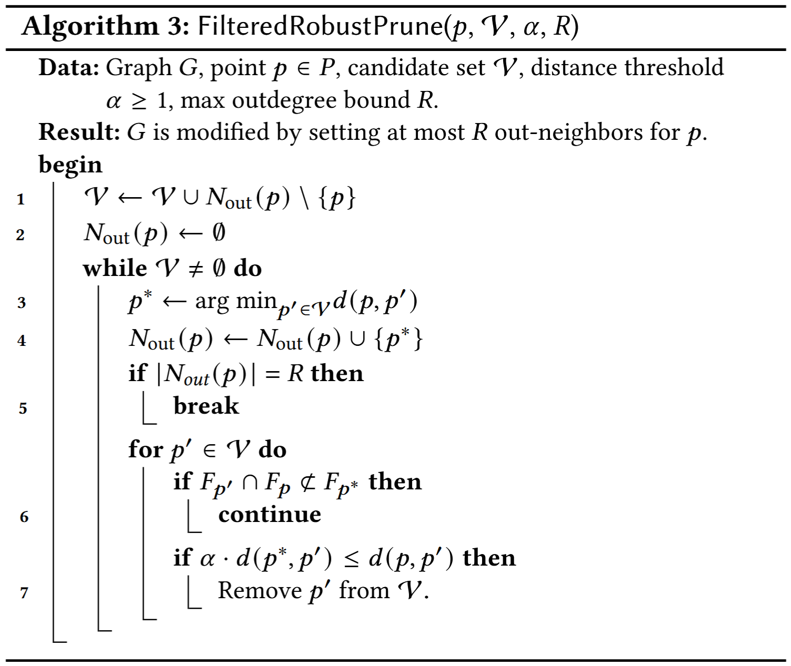
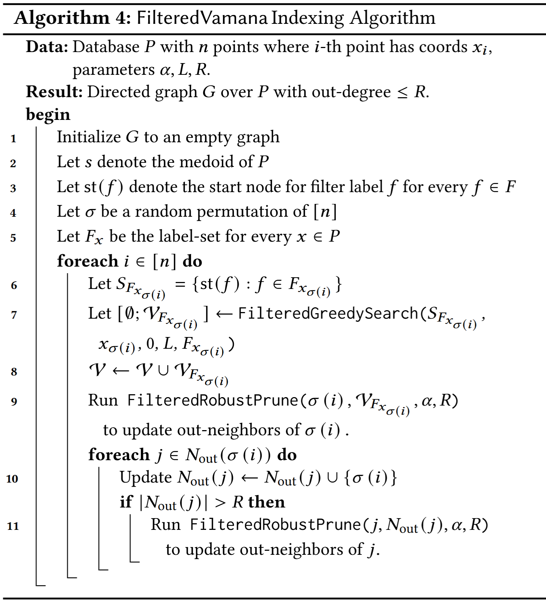
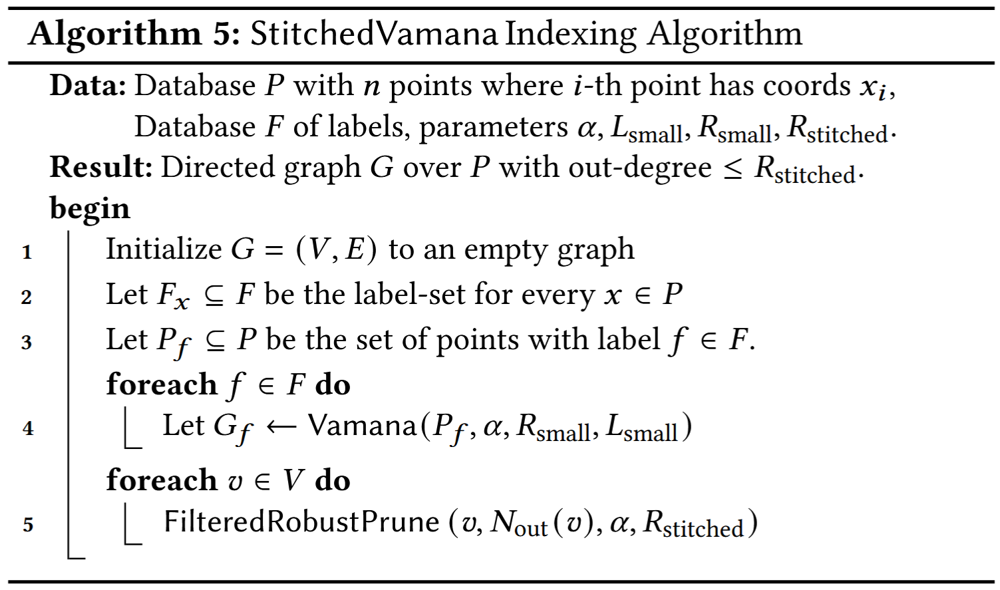

# DiskANN

全文字数: **{{ #word_count }}**

阅读时间: **{{ #reading_time }}**

---

## Background

DiskANN系列主要包含三篇论文：

- [DiskANN: Fast Accurate Billion-point Nearest Neighbor Search on a Single Node](https://papers.nips.cc/paper/9527-rand-nsg-fast-accurate-billion-point-nearest-neighbor-search-on-a-single-node.pdf)
- [FreshDiskANN: A Fast and Accurate Graph-Based  ANN Index for Streaming Similarity Search](https://arxiv.org/abs/2105.09613)
- [Filtered − DiskANN: Graph Algorithms for Approximate Nearest Neighbor Search with Filters](https://harsha-simhadri.org/pubs/Filtered-DiskANN23.pdf)

### SNG

## DiskANN: Fast Accurate Billion-point Nearest Neighbor Search on a Single Node

### Algorithm

#### GreedySearch

大多数基于图的近似最近邻搜索（ANN）算法的工作方式如下：在索引构建过程中，它们根据数据集 \( P \) 的几何属性构建图 \( G = (P, E) \)。在搜索时，对于查询向量 \( x_q \)，搜索采用自然的贪心或最优优先遍历，如算法1中的方式，在图 \( G \) 上进行。从某个指定的点 \( s \in P \) 开始，它们遍历图以逐步接近 \( x_q \)。

在SNG中，每个点 \( p \) 的外部邻居通过以下方式确定：初始化一个集合 \( S = P \setminus \{ p \} \)。只要 \( S \neq \emptyset \)，从 \( p \) 到 \( p^* \) 添加一条有向边，其中 \( p^* \) 是离 \( p \) 最近的点，从集合 \( S \) 中移除所有使得 \( d(p, p') > d(p^*, p') \)的点 \( p' \)。因此，贪心搜索（GreedySearch(s, \( x_p \), 1)）从任何 \( s \in P \) 开始都将收敛到 \( p \)，对于所有基点 \( p \in P \) 都成立。


#### RobustPrune

满足SNG性质的图都是适合贪心搜索搜索过程的良好候选图。然而，图的直径可能会相当大。例如，如果点在实数线的一维空间上线性排列，图的直径是 \( O(n) \)，其中每个点连接到两个邻居（一个在两端），这样的图满足SNG性质。搜索此类存储在磁盘上的图将导致在搜索路径中访问的顶点的邻居需要大量的顺序读取。

为了解决这个问题，希望确保查询距离在搜索路径的每个节点上按乘法因子 \( \alpha > 1 \) 递减，而不仅仅是像SNG性质那样递减。


#### Vamana Indexing

Vamana 以迭代的方式构建有向图 \( G \)。

1. 图 \( G \) 被初始化，使得每个顶点都有 \( R \) 个随机选择的外部邻居(在 \( R > \log n \) 时连接良好)。
2. 让 \( s \) 表示数据集 \( P \) 的中心点，它将作为搜索算法的起始节点。
3. 算法按随机顺序遍历 \( p \in P \) 的所有点，并在每一步更新图，使其更加适合贪心搜索（GreedySearch(s, \( x_p \), 1, L)）收敛到 \( p \)。

实际上，在对应点 \( p \) 的迭代中，

1. Vamana 在当前图 \( G \) 上运行 GreedySearch(s, \( x_p \), 1, L)，并将 \( V_p \) 设置为贪心搜索路径中所有访问过的点的集合。
2. 算法通过运行 RobustPrune(p, \( V_p \), \( \alpha \), \( R \)) 来更新图 \( G \)，以确定 \( p \) 的新外部邻居。
3. Vamana 更新图 \( G \)，通过为所有 \( p' \in N_{\text{out}}(p) \) 添加反向边（\( p', p \)）。这确保了在搜索路径和 \( p \) 之间的顶点连接，从而确保更新后的图会更适合贪心搜索（GreedySearch(s, \( x_p \), 1, L)）收敛到 \( p \)。
4. 添加这种形式的反向边（\( p', p \)）可能会导致 \( p' \) 的度数超过阈值，因此每当某个顶点 \( p' \) 的外度超过 \( R \) 的度数阈值时，图通过运行 RobustPrune(\( p' \), \( N_{\text{out}}(p') \), \( \alpha \), \( R \)) 来修改，其中 \( N_{\text{out}}(p') \) 是 \( p' \) 的现有外部邻居集合。

算法对数据集进行两次遍历，第一次遍历使用 \( \alpha = 1 \)，第二次使用用户定义的 \( \alpha \geq 1 \)。


```admonish question
为什么要分成两次遍历，不在一次中直接设定一个大于1的 \( \alpha \) 值完成图的构建？
```


### Design

#### Index Design

在数据集 \( P \) 上运行 Vamana，并将结果存储在 SSD 上。在搜索时，每当算法1需要某个点 \( p \) 的外部邻居时， 从 SSD 中获取该点的信息。

然而，单纯存储包含十亿个100维空间中的向量数据远超过工作站的RAM！这引出了两个问题：

1. 如何构建一个包含十亿个点的图？
2. 如果不能在内存中存储向量数据，如何在算法1的搜索时执行查询点与候选点之间的距离比较？

**问题一**

通过聚类技术（如k-means）将数据划分成多个较小的分片，为每个分片建立一个单独的索引，并仅在查询时将查询路由到几个分片。然而，这种方法会因为查询需要路由到多个分片而导致搜索延迟增加和吞吐量减少。

与其在查询时将查询路由到多个分片，不如将每个基础点发送到多个相邻的中心以获得重叠的聚类。事实上，我们将一个十亿点的数据集通过k-means划分为k个聚类（k=40，通常ℓ=2就足够），然后将每个基础点分配给ℓ个最近的中心。接着，我们为分配给每个聚类的点建立Vamana索引（这些点现在只有约Nℓ/k个点，可以在内存中建立索引），最后通过简单的边缘合并将所有不同的图合并为一个单一的图。

**问题二**

将每个数据库点 \( p \in P \) 的压缩向量 \( \tilde{x}_p \) 存储在主存中，同时将图存储在SSD上。使用Product Quantization将数据和查询点编码为短代码在查询时高效地计算近似距离 \( d(\tilde{x}_p, x_q) \)。尽管在搜索时只使用压缩数据，但是Vamana在构建图索引时使用的是“全精度坐标”，因此能够高效地引导搜索到图的正确区域，

#### Index Layout

将所有数据点的压缩向量存储在内存中，并将图以及全精度向量存储在SSD上。在磁盘中，对于每个点 \( i \)，我们存储其全精度向量 \( x_i \)，并跟随其\( \leq R \) 个邻居的标识。如果一个节点的度小于 \( R \)，我们用零填充，以便计算数据在磁盘中对应点 \( i \) 的偏移量变得简单，并且不需要在内存中存储偏移量。

#### Beam Search

运行算法1，按需从SSD获取邻居信息 \(N_{\text{out}}(p^*)\)。这需要很多次SSD的往返（每次往返仅需几百微秒），从而导致更高的延迟。为了减少往返SSD的次数（以便顺序地获取邻居），而不过多的增加计算量，一次性获取一个较小数量 \(W\)（例如4、8）最近的点的邻居，并将 \(\mathcal{L}\) 更新为这一小步中的前 \(L\) 个最优点。从SSD获取少量随机扇区的时间几乎与获取一个扇区的时间相同。

- 如果 \(W = 1\)，这种搜索类似于正常的贪婪搜索。
- 如果 \(W\) 太大，比如16或更多，则计算和SSD带宽可能会浪费。

#### Caching Frequently Visited Vertices

为了进一步减少每个查询的磁盘访问次数，缓存与一部分顶点相关的数据，这些顶点可以基于已知的查询分布来选择，或者通过缓存所有距离起始点 \( s \) 为 \( C = 3 \) 或 \( C = 4 \) 跳的顶点来选择。

由于索引图中与距离 \( C \) 相关的节点数量随着 \( C \) 增加呈指数增长，因此较大的 \( C \) 值会导致过大的内存占用。

#### Implicit Re-Ranking Using Full-Precision Vectors

由于PQ是一种有损压缩方法，因此使用基于PQ的近似距离计算出的与查询最接近的 \( k \) 个候选点之间存在差距。为了解决这个问题，使用存储在磁盘上与每个点相邻的全精度坐标。

事实上，在搜索过程中检索一个点的邻域时，也可以在不增加额外磁盘读取的情况下获取该点的全精度坐标。这是因为读取4KB对齐的磁盘地址到内存的成本不高于读取512B，而顶点的邻域（对于度为128的图，邻域大小为 \( 4 \times 128 \) 字节）和全精度坐标可以存储在同一磁盘扇区中。

因此，随着BeamSearch加载搜索前沿的邻域，它还会缓存在搜索过程中**访问的所有节点**的全精度坐标，而不需要额外的SSD读取操作。这使得我们能够基于全精度向量返回前 \( k \) 个候选点。

### Evaluation

(具体实验条件参见论文)

- 内存搜索性能比较
  - NSG和Vamana在所有情况下recall@100都优于HNSW
  - Vamana的索引构建时间优于HNSW和NSG
- 跳数（搜索中基于图的跳跃次数）比较
  - Vamana更适合用于基于SSD的搜索，其在大型数据集上比HNSW和NSG要快2到3倍。
  - 随着最大度数的增加，HNSW和NSG跳数出现了停滞趋势，而Vamana跳数有所减少，因为它能够增加更多的长距离边缘。推测Vamana在 \(\alpha > 1\) 时，比HNSW和NSG更好地利用了SSD提供的高带宽（在BeamSearch中，通过最大化𝑊来扩展搜索进行更大的磁盘读取）。
- One-Shot Vamana 和 Merged Vamana
  - Single：2 days, degree=113.9, peek memory usage=1100GB
  - Merged：5 days, degree=92.1, peek memory usage＜64GB
  - 单一索引优于合并索引，合并索引的延迟更高
  - 合并索引仍是十亿规模k-ANN索引和单节点服务的一个非常好的选择：相比单一索引，目标召回时只需增加不到20%的额外延迟


## FreshDiskANN: A Fast and Accurate Graph-Based  ANN Index for Streaming Similarity Search

### Introduction

在许多重要的现实场景中，用户与系统的交互会创建并销毁数据，并导致 \(P\) 的更新。针对这种应用的ANN系统需要能够托管包含数万亿个实时更新点的索引，这些更新可以反映数据集中的变化，理想情况下是实时进行的。

形式上定义 **fresh-ANNs** 问题如下：给定一个随时间变化的数据集 \(P\) （在时间 \(t\) 时的状态为 \(P_t\)），目标是维护一个动态索引，该索引计算任何查询 \(q\) 在时间 \(t\) 时，仅在活动数据集 \(P_t\) 上的近似最近邻。这样的系统必须支持三种操作：

- （a）插入新点，
- （b）删除现有点，以及
- （c）给定查询点进行最近邻搜索。
  
一个 **fresh-ANNs** 系统的总体质量由以下几个方面来衡量：

- 搜索查询的召回率与延迟之间的权衡，以及随着数据集 \(P\) 演变其对时间的鲁棒性。
- 插入和删除操作的吞吐量与延迟。
- 构建和维护此类索引所需的整体硬件成本（CPU、RAM 和 SSD 占用）。

freshDiskANN 注重于 **quiescent consistency** 的概念

```admonish quote
**quiescent consistency**: the results of search operations executed at any time t are  consistent with some total ordering of all insert and delete  operations completed before t.

quiescent consistency（静默一致性）是指在系统中执行的操作（如搜索、插入和删除）的结果，在某个时刻（如时间 𝑡）前的所有操作都已经完成，并且这些操作的结果与已执行的操作的顺序保持一致。如果一个查询需要依赖于之前的插入或删除操作，那么在查询时，插入和删除操作应已完成，并且查询结果应该基于这些已完成的操作。
```

**删除操作为什么难以实现？**

HNSW算法通过将删除的点添加到黑名单并将其从搜索结果中省略来处理删除请求，因为缺乏能够在保持原始搜索质量的同时修改可导航图的方法。考虑三种流行的静态ANNS算法，分别是HNSW、NSG和Vamana，并尝试了以下自然更新策略，看看在面对插入和删除操作时它们的表现。

- **插入策略。** 对于插入一个新点 \(p\)，运行相应算法使用的候选生成算法，并添加选定的入边和出边；如果任何顶点的度数超过预算，则运行相应的修剪过程。
- - **删除策略A。** 当删除一个点 \(p\) 时，简单地删除与 \(p\) 相关的所有入边和出边，而不添加任何新边以弥补潜在的可导航性丧失。
- **删除策略B。** 当删除一个点 \(p\) 时，移除所有与 \(p\) 相关的入边和出边，并在 \(p\) 的局部邻域中添加边：对于图中的每对有向边 \((p_{in}, p)\) 和 \((p, p_{out})\)，在更新的图中添加边 \((p_{in}, p_{out})\)。如果任何顶点的度数超过限制，则运行相应算法的修剪过程来控制度数。


一个稳定的更新策略应该在每个周期之后产生相似的搜索性能，因为索引是建立在相同的数据集上的。然而，所有算法都表现出搜索性能持续下降的趋势。

**FreshVamana**

随着图的更新，图变得稀疏（平均度数较小），因此变得不那么可导航。怀疑这是由于现有算法（如HNSW和NSG）使用非常激进的修剪策略来偏向稀疏图所导致的。

**α-RNG Property.** DiskANN中构建的图的关键思想是采用更为宽松的剪枝过程，它仅在存在一条边 \((p, p')\) 且 \(p'\) 必须比 \(p\) 更接近 \(p''\) 时才移除边 \( (p, p') \)，即 \(d(p', p'') < \frac{d(p, p'')}{\alpha}\)，其中 \(\alpha > 1\)。使用 \(\alpha > 1\) 生成这样的图直观地确保了查询向量到目标向量的距离在算法 1 中以几何方式逐步减小，因为只移除那些存在绕道边，使得s'yu显著朝目标方向推进的边。因此，随着 \(\alpha\) 的增加，图变得更加密集。**利用α-RNG属性，确保图的持续可导航性，并保持多个插入和删除操作过程中的稳定召回率。**

### Algorithms

GreedySearch 与 DiskANN中的算法1相同

#### Index Build

构建一个可导航图。图的构建通常有两个对立的目标，以最小化搜索复杂度：

1. 使应用到每个基点 \(p \in P\) 上的贪心搜索算法在最少的迭代中收敛到 \(p\)
2. 使所有 \(p \in P\) 的最大出度 \(R\) 不超过 \(R\)

```admonish quote
NN-Descent使用梯度下降来确定图G。其他方法从特定类型的图开始，例如没有边的空图或一个近似的 \(k\)-NN图
```

从初始图开始，经过以下两步构建算法逐步精炼G，以提高可导航性。

1. **生成候选** ： 对于每个基点 \(x_p\)，在图 \(G\) 上运行算法1（从固定的起始点s开始）来获得 \(\mathcal{V}, \mathcal{L}\)，其中 \( \mathcal{L}\) 包含最接近 \(p\) 的节点，将它们添加到 \(Nout(p)\) 和 \(Nin(p)\) 的良好候选，从而提高更新图G中对 \(p\) 的可导航性。
2. **边修剪** ： 当节点 \(p\) 的出度超过 \(R\) 时，修剪算法（如算法3，\(\alpha = 1\)）会从邻接列表中过滤出类似的（或冗余的）边，以确保 \(|Nout(p)| \leq R\)。过程会按距离 \(p\) 的增大顺序对其邻居进行排序，如果算法1能够通过 \(p'\) 从 \(p\) 到达 \(p''\)，则可以安全地移除边 \((p, p')\)）。

#### Insertion

1. 对于新插入的点 \(p\)，从起始点 \(s\) 开始运行\(\text{GreedySearch}(s, p, 1, L)\)，将**访问过的点保存在\(\mathcal{V}\)中**。
2. 将\(\text{RobustPrune}(p, \mathcal{V}, \alpha, R)\)后的结果集合**作为\(p\)的邻居**。
3. **对\(p\)的每一个邻居进行剪枝**，确保其加入新邻居后的度数不超过\(R\)。


<!-- 使用基于锁的并发控制来保护对节点 \(p\) 的 \(N_{out}(p)\) 的访问，从而允许通过多个线程进行高效插入。由于锁的粒度较细，并且锁保持的时间较短，因此插入吞吐量在多线程下接近线性扩展。 -->

#### Deletion

1. 对于删除后的图中剩余的每一个点，检查其出边是否包含已删除的点，若有则继续
2. 将出边中包含的已删除点的邻居加入到集合\( \mathcal{D}\)中
3. 将出边中其余的点加入到集合\( \mathcal{C}\)中
4. 对于集合\( \mathcal{D}\)中的每一个点，将其邻居加入到集合\( \mathcal{C}\)中
5. 在集合\( \mathcal{C}\)中排除那些已经被删除的点（\( \mathcal{D}\)）
6. 运行\(\text{RobustPrune}(p, \mathcal{C}, \alpha, R)\)来更新其出边

```admonish tip
把每个点的邻居中被删除的点的邻居加入到该点的邻居中，再进行剪枝。尽量保持图的连通性。
```


算法 4 参考了上文中的 **删除策略B**，关键特性是使用宽松的 \(\alpha\)-剪枝算法来保持修改后图的稠密性。具体而言，如果删除点 \(p\)，则在图中添加边 \( (p', p'') \)，其中 \( (p', p) \) 和 \( (p, p'') \) 是有向边。在此过程中，如果 \( |N_{out}(p')| \) 超过最大出度 \(R\)，我们使用算法 3 对其进行剪枝，以保持 \(\alpha\)-RNG 性质。

然而，由于该操作涉及编辑 \(p\) 的所有入邻居的邻域，代价可能很大，无法在删除到达时立即处理。FreshVamana 采用了懒删除策略 —— 当一个点 \(p\) 被删除时，我们将 \(p\) 添加到 DeleteList 中而不改变图。DeleteList 包含所有已删除但仍存在于图中的点。在搜索时，修改后的算法 1 会使用 DeleteList 中的节点进行导航，但会从结果集中筛选掉它们。

**删除合并**。在累积了大量删除操作（例如，索引大小的 1%-10%）后，使用算法 4 批量更新图，以更新有出边的点的邻居，从而将这些删除的节点更新到图中。
<!-- 此操作可以通过前缀和操作来并行化，并通过并行映射操作来本地更新删除节点周围的图。 -->


- 一组良好的更新规则应能保持召回率在这些循环中稳定。
- 除 𝛼 = 1 外，所有索引的召回率都是稳定的，这验证了使用 𝛼 > 1的重要性。

### FreshDiskANN system

FreshDiskANN 系统的主要思想是将大部分图索引存储在 SSD 上，仅将最近的更改保存在 RAM 中。  

为了进一步减少内存占用，可以仅存储压缩向量来表示所有数据向量。使用 \( \alpha \)-RNG 图并仅存储压缩向量的思想构成了基于 SSD 的 DiskANN 静态 ANNS 索引的核心。  

由于无法直接在 SSD 驻留的 FreshVamana 索引上运行插入和删除算法。插入一个新点 \( x_p \) 需要更新至多 \( R \) 个邻居以向 \( p \) 添加边，这将触发最多 \( R \) 次随机写入 SSD。意味着每次插入都需要进行同等数量的随机 SSD 写入。这将严重限制插入吞吐量，并降低搜索吞吐量（SSD 上的高写入负载会影响其读取性能）。如果每次删除操作都立即执行，则会导致 \( R_{\text{in}} \) 次写入。  

FreshDiskANN 系统规避了这些问题，并通过拆分索引为两部分，将基于 SSD 的系统的效率与基于内存系统的交互式低延迟结合起来：

1. **内存中的 FreshVamana 组件**：用于存储最近的更新；
2. **驻留在 SSD 上的索引**：用于存储长期数据。

#### Components

系统维护两种索引：**长期索引**（Long-Term Index，LTI）和一个或多个**临时索引**（Temporary Index，TempIndex），以及**删除列表**（DeleteList）。  

- **LTI** 是**驻留在 SSD 上的索引**，用于支持搜索请求。它的内存占用很小，每个点的存储仅包含约 25-32 字节的压缩表示。其关联的图索引和完整精度数据存储在 SSD 上。**插入和删除操作不会实时影响 LTI**。  
- **、TempIndex**，完全存储在**DRAM** 中的 FreshVamana 索引实例（包括数据和相关图结构）。TempIndex 存储了最近插入的点 \( P \)。**内存占用仅占整个索引的一小部分**。
- **DeleteList** 其中的点存在于 LTI 或 TempIndex 中，但已被用户请求删除。此列表用于**过滤搜索结果中已删除的点**。  
- **RO- 和 RW-TempIndex**  为了支持崩溃恢复，FreshDiskANN 使用两种类型的 TempIndex。在任何时候，FreshDiskANN 都会维护一个**可变的可读写 TempIndex**（称为 **RW-TempIndex**），它可以接受插入请求。**定期将 RW-TempIndex 转换为 只读的内存索引（RO-TempIndex）**，并将其**快照存储到持久化存储**。随后创建一个新的空 **RW-TempIndex** 以接收新的插入点。  

#### API

- **Insert(xₚ)**：将一个新点插入索引中，路由到RW-TempIndex的唯一实例，该实例使用算法2来处理该点。
- **Delete(p)**：删除请求，将已存在的点p添加到DeleteList中。
- **Search(xq, K, L)**：搜索K个最近的候选项，使用大小为L的候选列表，通过查询LTI、RW-TempIndex和所有RO-TempIndex实例来执行，参数为K和L，聚合结果并移除DeleteList中的已删除条目。

#### StreamingMerge

每当各个RO-TempIndex的总内存占用超过预定的阈值时，系统就会调用一个后台合并过程，修改驻留在SSD上的LTI，以反映来自不同RO-TempIndex实例的插入，并同时处理来自DeleteList的删除请求。为了方便记法，假设数据集P表示LTI中的点，N表示当前阶段的点，它们存在于不同的RO-TempIndex实例中，D表示标记为删除的点。

删除点之后，**StreamingMerge**的期望结果是一个驻留在SSD上的LTI，数据集为(P ∪ N) \ D。合并过程完成后，系统清除RO-TempIndex实例，从而保持总内存占用在可控范围内。该过程必须遵循以下两个重要约束：

- **内存占用**应与变化的大小|D|和|N|成比例，而不是与整个索引|P|的大小成比例。因为LTI的内存占用可能远大于机器的内存。
- **有效使用SSD I/O**，以便在后台进行合并时，仍然可以执行搜索操作，这样合并过程本身可以快速完成。

从高层次来看，StreamingMerge首先运行算法4来处理来自D的删除操作，以获得P \ D点的中间LTI索引。然后，StreamingMerge运行算法2，将N中的每个点插入到中间LTI中以获得最终的LTI。然而，算法2和算法4假设LTI图以及所有数据点的全精度向量都存储在内存中。StreamingMerge的关键挑战之一是以内存和SSD高效的方式模拟这些算法调用。该过程分为以下三个阶段：

1. **删除阶段**：该阶段处理输入的LTI实例，并通过运行算法4处理删除操作D，生成中间LTI。为了以内存高效的方式完成此操作，我们按块从SSD中加载LTI中的点及其邻居，并使用多线程执行算法4来处理块中的节点，然后将修改后的块写回到SSD中的中间LTI。此外，每当算法4或算法3进行距离比较时，我们使用已存储的压缩PQ向量来计算近似距离，而不是使用准确的距离。请注意，这一做法替代了精确的距离计算，通过使用压缩向量来计算近似距离，这将在StreamingMerge的后续阶段中继续使用。

2. **插入阶段**：该阶段将所有新点N添加到中间LTI中，模拟算法2的过程。作为第一步，我们在SSD驻留的中间LTI上运行GreedySearch(s, p, 1, L)来获取搜索路径上访问的顶点集V。由于图存储在SSD中，任何由搜索算法请求的邻居Nout(p′)都将从SSD中获取。α-RNG属性确保了邻居请求的数量较小，从而保证了每个点的总体延迟是有界的。然后，我们运行RobustPrune(p, V, α, R)程序来确定p的候选邻居集。然而，与算法2不同，我们不会立即尝试将p插入到Nout(p′)中（即反向边），因为这可能导致大量随机的读取和写入操作，从而影响效率。

3. **修补阶段**：在处理完所有插入后，我们将Δ数据结构修补到输出的SSD驻留LTI索引中。为此，我们按块从SSD中获取中间LTI中的所有点p，添加每个节点p的相关出边，并检查新的度数|Nout(p) ∪ Δ(p)|是否超过R。如果超过，则通过设置Nout(p) = RobustPrune(p, Nout(p) ∪ Δ(p), ·, ·)来修剪邻居。此操作可以以数据并行的方式应用于每个节点。随后，更新后的块将写回到SSD中，之后再加载新的块。

**Complexity**

- **I/O成本**：该过程在删除和修补阶段分别对SSD驻留的数据结构进行了两次顺序遍历。由于中间LTI的\(\alpha\)-RNG属性，插入算法每插入一个点都会执行少量的随机4KB读取（每个插入点大约100次磁盘读取，比候选列表大小参数（我们通常设为75）多一点）。请注意，如果没有\(\alpha\)-RNG属性，这个数字会大得多，因为可能存在非常长的导航路径。
- **内存占用**：在整个**StreamingMerge**过程中，\(\Delta\)数据结构的大小为\(O(|N|R)\)，其中\(R\)是索引的最大度数，通常是一个较小的常数。例如，如果\(|N| = 30M\)，且\(R = 64\)，则内存占用大约为7GB。此外，为了计算近似距离，我们还会保留PQ坐标的副本，用于索引中的所有点（大约32GB用于一个十亿点的索引）。
- **计算需求**：插入阶段和修补阶段的复杂度与要插入的新点\(N\)的大小基本成线性关系，因为插入阶段仅使用算法1对\(N\)中的新点进行搜索，并更新\(\Delta\)数据结构；修补阶段则以块为单位添加反向边。

删除阶段的固定成本较小，仅需扫描每个点\(p \in P\)的\(N_{out}(p)\)，并检查是否有已删除的点，同时存在一个较大的变量成本，与删除集大小\(|D|\)成线性关系，我们会将其上界为\(O(|D|R^2)\)（假设随机删除）。有关这一计算的详细信息，请参见附录D。

**Recall Stability**

尽管我们已经证明了我们的更新算法算法2和4在第4.3节中的长时间更新流中确保了召回稳定性，但这些算法在我们**StreamingMerge**过程中的实际实现形式是不同的，特别是使用了用于距离计算的近似压缩向量。实际上，随着我们处理更多的**StreamingMerge**过程周期，我们预计初始图将被完全基于近似距离构建的图所替代。因此，我们预计初期会有小幅下降，但随后召回率将稳定。

在图4中的实验中，我们首先使用从SIFT100M数据集中随机采样的80M点构建了静态SSD索引。然后，在每个周期中，我们使用**StreamingMerge**更新索引，以反映8M个删除和来自20M点备用池的等量插入。我们总共运行了40个周期的实验，并在图4中跟踪了每个周期后索引的召回率。请注意，索引的稳定值低于静态索引的初始召回率，这是因为在**StreamingMerge**过程中使用了近似距离。我们观察到，在删除和插入大约10%索引大小的20个周期后，召回率稳定，此时我们预计大部分图是通过近似距离确定的。图4（右）展示了SIFT1B的800M点子集的相似图。我们已经通过实验证明，FreshDiskANN索引能够在更新流的稳态中保持稳定的召回率。



#### Crash Recovery

为了支持崩溃恢复，所有索引更新操作都会写入重做日志。当崩溃导致单个RW-TempIndex实例和DeleteList丢失时，它们通过从最近的快照回放重做日志中的更新来重建。由于RO-TempIndex和LTI实例是只读的并且定期快照到磁盘，它们可以简单地从磁盘重新加载。

RW-TempIndex被快照到RO-TempIndex的频率取决于预期的恢复时间。更多的快照会导致RW-TempIndex的重建时间较短，但会创建多个RO-TempIndex实例，所有这些实例必须在每个查询中进行搜索。虽然搜索几个额外的小型内存索引不会成为查询的限制步骤（因为搜索大型LTI很耗时），但是创建太多索引可能导致低效的搜索。对于一个十亿点的索引，通常会在每次合并到LTI之间保留最多30M个点的TempIndex。在内存中限制每个索引为500万个点会导致最多6个TempIndex实例可以在0.77毫秒内完成搜索，相比之下，搜索单个30M大小的索引需要0.89毫秒，且候选列表大小为100。

## Filtered − DiskANN: Graph Algorithms for Approximate Nearest Neighbor Search with Filters

### FreshDiskANN Introduction

随着基于近似最近邻搜索（ANNS）的稠密检索在搜索和推荐场景中的广泛应用，有效回答过滤后的ANNS查询已成为一个关键需求。过滤后的ANNS查询要求从索引中的点中找到与查询的标签（如日期、价格范围、语言）匹配的最近邻。当前的索引具有较高的搜索延迟或较低的召回率。

本文提出了两种具有原生支持的算法，以便更快速、更准确地回答过滤后的ANNS查询：一种支持流处理，另一种基于批量构建。算法的核心是构建一个图结构索引，该索引不仅基于向量数据的几何形状形成连接，还包括相关的标签集。

大多数当前针对过滤后的 ANNS 方法的共同点是，它们只修改了搜索步骤，而没有修改索引构建步骤。

#### Drawback of Existing Methods

一种直接的方法来回答混合查询是后处理方法：构建一个标准的 ANNS 索引，像往常一样查询，并通过选择仅那些与查询过滤器匹配的索引返回结果来进行后处理。虽然这种方法容易实现，但在实践中效果不佳。事实上，对于一个低特异性的标签过滤器 f，我们可能需要检索大量候选项才能找到一个符合过滤器的结果。

相反，可以考虑一种简单的预处理方法，即为每个可能的可过滤标签 f ∈ F 构建一个单独的索引，以便将查询路由到与查询过滤器关联的索引。然而，这种方法在过滤器数量庞大或每个点可能有多个关联过滤器的情况下，将很快变得代价高昂。

```admonish tip
ANNS 索引需要从 \( P \) 中找到与 \( x_q \) 最近的邻居，条件是这些邻居的标签与 \( f \) 匹配，即从集合 \( P_f = \{ x \in P : f \in F_x \} \) 中选择点。索引应最大化 \( \text{recall@}k \)，但它是相对于使用集合 \( P_f \) 计算的真实值，而不是 \( P \)。在实际使用中通常无法事先确定满足结果的top-k需要多少个候选项，因为\( P \)中的top-k很有可能大部分都不在 \( P_f \) 中。
```

<!-- Weaviate 和 Milvus 都在将查询通过图索引之前使用了更高效的预处理步骤。

- Weaviate 首先通过倒排索引传递查询的标签，以生成一个批准的点列表。
- Milvus 保持一个关于点的属性分布，并使用哈希表将查询中常用的属性映射到“批准列表”中的点。

在搜索时，只有批准列表中的点被考虑。虽然这两种数据结构是在索引时创建的，但它们不会改变主要的向量相似度搜索索引：它们的不同之处在于它们影响搜索过程如何遍历主索引。

有些算法可以实时地应用，我们将其称为内联处理。举个例子，FAISS-IVF  将数据划分为多个簇，而 ANN 数据结构是一个包含所有属于每个簇的点的倒排索引。通过在每个倒排索引条目中包含过滤元数据，内联处理搜索可以应用到 LSH  索引中。

然而，基于图的 ANNS 索引（例如 HNSW  和 Vamana ）在索引中点的数量上，比 IVF/LSH 索引在查询时的效率高一个数量级，并且随着数据量的增加，这一差距也会增大。因此，需要高性能的互动网页服务（如搜索、广告和企业文档推荐）会使用基于图的 ANNS 索引，以实现高吞吐量和高召回率，同时确保查询延迟在几毫秒内。当前对支持过滤查询的方式并未充分利用图索引提供的巨大查询效率，而是专注于优化更低效的索引技术。 -->

<!-- #### Techniques

我们的主要贡献是两个简单但有效的基于图的算法，针对过滤的 ANN（近似最近邻搜索）——FilteredVamana 和 StitchedVamana ——它们基于 Vamana 图 。像 Vamana 一样，基于图的索引通过构建可导航图来有效地引导一个局部“贪婪”搜索，朝向查询的最近邻候选点。根据我们所知，现有的算法（除了 NHQ）仅考虑数据集中点的位置信息（即向量坐标），而没有考虑过滤元数据。这里提出的两个算法更进一步，利用不仅是点之间的几何关系，还利用了每个点的标签，在构建图的导航结构时发挥作用。

FilteredVamana 算法从一个空图开始，并逐步将点加入索引，同时添加边，如下所示。对于第 \(i\) 个点 \(x_i\)，其关联标签为 \(F_i\)，我们找到一组合适的多样候选邻居并添加双向边。然后，当任何节点的度数超过给定阈值 \(R\) 时，我们运行一个名为 RobustPrune 的过程来修剪冗余边，考虑点的几何信息和过滤信息。

StitchedVamana 算法采取批量索引的方法。它为每个标签过滤器 \(f\) 构建一个独立的 Vamana 索引，并将这些索引叠加在一起，形成一个图，其中每条边是过滤器特定图中边的并集。这导致了一个可能非常大的索引，就像为每个过滤器单独构建一个索引一样。为了减少索引大小，我们运行一个 RobustPrune 算法，用于每个度数超过 \(R\) 的节点。

直观地，大家可能会认为 StitchedVamana 比 FilteredVamana 更有效，因为每个节点在剪枝步骤之前会积累大量有用的候选项（当取并集时），而 FilteredVamana 在每当度数超过 \(R\) 时都实时地修剪。我们的实验结果确实验证了这一点。然而，FilteredVamana 索引构建得更快，并且更容易进行增量更新。我们将在第五节中评估这些算法的优点，并与文献中的其他算法进行对比。

我们现在总结一下我们的贡献：

1. 我们的算法生成的索引能够支持成千上万的过滤器 (\(|F| \sim 1000\))，并且每个点 \(P\) 都与数十个或数百个过滤器相关联。值得注意的是，这些索引在资源消耗（如索引大小）上与先前的无过滤的基于图的 ANN 索引几乎相同。
2. 我们将我们的算法与许多现有的公共基线进行比较，包括 IVF、HNSW、NHQ 和 Milvus，结果显示我们的算法在性能上超越基线一个数量级或更多。我们的算法可以调整，以便提供尽可能接近 100% 的召回率，即使对于那些特异性低至 \(10^{-4}\) 到 \(10^{-6}\) 的过滤器，而其他算法的召回率在较低值时便趋于饱和。
3. 我们展示了在一个涉及过滤器的真实世界广告场景中，算法在关键指标上的显著改进。算法显著提高了召回率，同时保持严格的延迟预算，收入提升范围为 30% 到 80%，具体取决于查询的特异性。
4. 索引还可以像 DiskANN 系统  中那样存储在廉价的 SSD 上，从而实现低延迟、90% 以上的召回率，并支持每秒数千个查询。 -->

#### Related Work

已有大量的研究致力于 ANN（近似最近邻搜索）算法的研究 。见最近的基准测试 ，对最先进的 ANN 算法的比较。大多数现有的研究从提高召回率 、规模和成本效率 、分布式索引 、启用实时索引更新  和设计具有理论保证的算法  等角度解决标准的 ANN 问题。随着 ANN 在语义搜索/密集检索中的日益重要的角色，许多应用关键需求在研究文献中未得到充分关注，其中之一就是过滤或过滤查询（这两个术语可互换使用）。

最近有两项关于过滤 ANN 的研究工作。Analytic DB-V ，阿里巴巴的实际系统集成了过滤 ANN 查询，并在 SQL 引擎上进行了优化。它支持并优化了基于查询计划的复杂过滤器，查询计划根据过滤器的特异性来处理：

- 高特异性：后处理索引
- 中等特异性：内联处理 IVF-PQ  索引
- 低特异性：内联处理蛮力索引

在这项工作中，我们限制为更简单的过滤器——与一个过滤器的精确匹配。为了在交互延迟和高召回率下支持此类搜索，我们开发了新的基于图的索引，这些索引可以更新。我们可以通过简单地找到对应每个单独过滤器的答案，并按查询的距离对这些结果进行聚合和排序，轻松扩展到多个过滤器的并（OR）操作。我们将多个过滤器的合取（AND）和其他更复杂的表达式留作未来工作中的挑战。请注意，当可能的谓词集合已知且不太大（几千个）时，我们可以为每个向量标注谓词，以标识它所满足的条件，并构建图来支持通过这些标签进行过滤。

另一个支持过滤查询的近期算法是 NHQ 算法 。它与我们的工作相关，因为它是基于图的，并且实际上修改了索引步骤：它们将过滤器标签编码为向量，并将其附加到真实向量和使用 ANN 算法（如 NSW 或 kNN-graph ）的索引中。然而，这篇论文考虑的是每个数据点有效地只与一个过滤器标签相关的情况——即集合 \(P_f\) 是完全不交集的，这种情况可以通过为每个过滤器分别使用标准的 ANN 索引来处理。此外，这种技术在扩展到多个过滤器/标签时可能会无效，因为每个点的过滤器/标签的数量越多，召回率的显著性影响越大。如果索引中的某一点有三个过滤器标签，而查询只有一个，那么索引中其他两个标签坐标的距离会对候选点产生不利影响，相比之下，只有相同查询标签的数据点将受到更少的影响。我们证明了我们的方法优于 NHQ，并在附录中进一步证明，这比 Analytic DB-V  的表现要好得多。

### FilteredVamana

基于图的ANNS索引是这样构造的，使得贪婪搜索能够快速收敛到查询向量 \( x_q \) 的最近邻。我们首先描述了过滤查询的贪婪搜索的自然适应，称为FilteredGreedySearch（算法1），以及一个索引构建过程（算法4），该过程允许搜索通过相对较少的距离比较收敛到正确的答案。

#### FilteredGreedySearch

给定一个查询 \( x_q \) 和一组标签 \( F_q \)，我们要求输出 \( k \) 个近似最近邻，其中输出的每个点至少与 \( F_q \) 共享一个标签。搜索过程还接收一组起始节点 \( S \)。对于具有标签集 \( F_q \) 的查询，集合 \( S \) 通常是 \( \{ st(f) : f \in F_q \} \)，其中 \( st(f) \) 是在索引构建期间为标签 \( f \in F \) 计算的指定起始节点。

在本文中，我们基准测试了标签集 \( F_q \) 是单元素集合的查询，但该算法也可以用于具有 \( |F_q| > 1 \) 的查询。

该算法维护一个最多包含 \( L \) 个元素的优先队列 \( \mathcal{L} \)。每次迭代时，它会寻找 \( \mathcal{L} \) 中最近的未访问邻居 \( p^* \) 。然后将 \( p^* \) 添加到已访问节点的集合 \( \mathcal{V} \) 中，这是本文稍后引用的一个有用不变式。接着，我们仅**将那些从 \( p^* \) 出发且至少拥有 \( F_q \) 中一个标签的外邻添加到队列 \( \mathcal{L} \)**。最后，如果 \( |\mathcal{L}| > L \)，我们将 \( \mathcal{L} \) 截断为包含距离 \( x_q \) 最近的 \( L \) 个点。搜索在所有 \( \mathcal{L} \) 中的节点都已被访问时终止。输出由 \( \mathcal{L} \) 中的 \( k \) 个最近邻和已访问节点集合 \( \mathcal{V} \) 组成，后者对索引构建有用（但在用户查询中无用）。



#### Index Construction

**起始点选择**。我们要求每个过滤器的起始节点满足两个条件：

1. 对于带有单一过滤器 \( f \) 的查询，起始点 \( s \equiv st(f) \) 应与该过滤器相关联，即 \( f \in F_s \)；
2. 不应有点在 \( P \) 中作为过多过滤标签的起始点。使用不同过滤器的查询应该跨越许多点来共享，以便我们可以构建一个具有小度数的图，该图适用于所有过滤标签。
 
实际上，如果一个单一节点作为许多标签的起始点，则从该起始点出发，可能很少有邻接节点带有某个标签，从而导致搜索效果差。我们通过使用算法2中描述的简单随机化负载平衡算法来实现这一点。



<!-- 这个算法 **FindMedoid** 的目的是将过滤器映射到数据集 \( P \) 中的起始节点。数据集中的每个点都有一个或多个与之关联的过滤器，同时使用阈值 \( \tau \) 来限制每个过滤器选择的样本数。

数据输入：
- \( P \)：数据集，每个点都有相关联的过滤器。
- \( \tau \)：阈值，控制每个过滤器所考虑的随机样本数量。

输出：
- \( M \)：一个映射，将每个过滤器与其对应的起始节点（即“中位点”）关联起来。

算法步骤解析：
1. **初始化变量**：
   - \( M \)：最终的映射，将每个过滤器映射到其对应的起始节点（中位点）。
   - \( T \)：计数映射，初始化为所有点的值为零。\( T \) 用于跟踪每个点作为候选中位点被选择的次数。

2. **遍历所有过滤器**：
   - 对于每个过滤器 \( f \in F \)，算法会执行以下步骤：
     
     - **第1步（第2行）**：
       - 让 \( P_f \) 表示所有匹配过滤器 \( f \) 的点的集合。这些点可以作为该过滤器的候选点。
     
     - **第2步（第3行）**：
       - 从 \( P_f \) 中随机选择 \( \tau \) 个数据点。这个步骤通过限制选择的样本数量来减少计算量。
     
     - **第3步（第4行）**：
       - 在随机选中的点中，算法选择使得 \( T[p] \) 最小的点 \( p^* \)，即选择被选为中位点次数最少的点。这个点 \( p^* \) 就是该过滤器的“起始节点”。
     
     - **第4步（第5行）**：
       - 更新映射 \( M \)，使得 \( M[f] = p^* \)，即过滤器 \( f \) 被映射到点 \( p^* \)。
       - 更新计数映射 \( T[p^*] \)，将 \( p^* \) 的计数加 1，表示它被选为中位点。

3. **返回映射 \( M \)**：
   - 最后，算法返回映射 \( M \)，该映射将每个过滤器与其对应的起始节点（中位点）关联起来。

算法的目的：
**FindMedoid** 算法的目的是根据与每个过滤器相关联的点，选出一个代表性的“中位点”作为起始节点。这个中位点将作为后续处理过程中该过滤器的起始节点。算法通过随机采样和选择被选中的次数最少的点来高效地选择合适的中位点，从而减少计算开销，同时确保所选起始节点的多样性。 -->


**增量图构建**。FilteredVamana图构建是一个增量算法。我们首先为每个过滤标签识别起始节点 \( st(\cdot) \)，并初始化一个空图 \( G \)。然后，对于每个数据点 \( p \in P \)，与之关联的过滤器/标签 \( f \in F_p \)，我们运行FilteredGreedySearch(\( S_{F_p} \), \( x_p \), \( L \), \( F_p \))，并以集合 \( S_{F_p} = \{ st(f) : f \in F_p \} \) 为起始点。这将返回一组在搜索中访问到的节点 \( V_{F_p} \)。所有已访问的节点都具有标签 \( f \in F_p \)。

接着，我们通过调用算法3中的过滤感知剪枝过程，以参数 (\( x \), \( V \), \( \alpha \), \( R \)) 来修剪候选集 \( V_{F_p} \)。这确保了图节点对应的 \( x \) 至多有 \( R \) 个外邻。



**外邻剪枝**，同时消除冗余的近邻向量。剪枝过程依赖于以下原则：对于顶点三元组 \( a \)，\( b \)，\( c \) 和常数 \( \alpha \geq 1 \)，如果满足下列条件，则可以将有向边 \( (a, c) \) 从图中剪除：

1. 边 \( (a, b) \) 存在，
2. 向量 \( x_b \) 比 \( x_a \) 更接近 \( x_c \)，即 \( \| x_b - x_c \| \leq (1/\alpha) \| x_a - x_c \| \)，
3. \( F_b \) 包含 \( F_a \) 和 \( F_c \) 所有共同的过滤标签，即 \( F_a \cap F_c \subseteq F_b \)。

最后，我们从 \( y \) 到 \( x \) 添加反向边，其中 \( y \in N_{out}(x) \)，并且，如果任何此类 \( y \) 的度数超过 \( R \)，我们在 \( y \) 上运行FilteredRobustPrune过程。

```admonish question
是否为每一个标签单独构建一个不含其他标签的索引？
```



### StitchedVamana

我们现在提出一个用于构建索引的不同算法，称为 StitchedVamana（算法 5），该算法只能在已知点集的情况下使用。对于每个 \( f \in F \)，我们使用 Vamana 算法 [39] 在带有标签 \( f \) 的点集 \( P_f \) 上构建图索引 \( G_f \)，其参数为 \( L_{small} \) 和 \( R_{small} \)。这些参数比前一个算法中的参数更小，从而加速了索引构建。接下来，由于顶点可能属于多个图（即一个点 \( p \in P \) 可能属于多个 \( P_f \)），我们将各个图 \( G_f \) “拼接”到图 \( G \) 中，图 \( G \) 的边是每个 \( G_f \) 的边集的并集。图 \( G \) 可能会有较大的度数。我们通过使用 FilteredRobustPrune 程序将其最大外度数减少到 \( R_{stitched} \)。最终的图与 FilteredGreedySearch 程序兼容。



```admonish note
为每个标签单独构建包含该标签的点集的索引，最后将边集合并到一个图中，修剪图的总度数。
```

## Summary

### Comparison of Vamana with HNSW and NSG

Vamana 与 HNSW 和 NSG 非常相似。这三种算法都在数据集 \( P \) 上进行迭代，并使用 GreedySearch(s, \( x_p \), 1, L) 和 RobustPrune(p, \( V \), \( \alpha \), \( R \)) 的结果来确定 \( p \) 的邻居。这些算法之间存在一些重要的差异。

- 最关键的是，HNSW 和 NSG 都没有可调参数 \( \alpha \)，而且隐式使用 \( \alpha = 1 \)。(这是使 Vamana 在图的度数和直径之间实现更好折衷的主要因素)
- 虽然 HNSW 将候选集 \( V \) 设置为贪心搜索（GreedySearch(s, \( p \), 1, L)）的修剪过程的最终候选结果集，Vamana 和 NSG 将 \( V \) 设置为贪心搜索（GreedySearch(s, \( p \), 1, L)）访问的所有顶点的集合。从直觉上讲，这个特征有助于 Vamana 和 NSG 添加长距离边，而 HNSW 仅通过添加局部边来构建图的层次结构，进而构建嵌套的图序列。
- NSG 将数据集上的图初始化为近似 \( K \)-最近邻图，这是一个时间和内存密集型的步骤，而 HNSW 和 Vamana 则有更简单的初始化过程，前者从一个空图开始，Vamana 从一个随机图开始。
- Vamana 进行两次遍历数据集，而 HNSW 和 NSG 只进行一次遍历，动机是基于我们观察到的第二次遍历能提高图的质量。

> - [DiskANN: Fast Accurate Billion-point Nearest Neighbor Search on a Single Node](https://papers.nips.cc/paper/9527-rand-nsg-fast-accurate-billion-point-nearest-neighbor-search-on-a-single-node.pdf)
> - [FreshDiskANN: A Fast and Accurate Graph-Based  ANN Index for Streaming Similarity Search](https://arxiv.org/abs/2105.09613)
> - [Filtered − DiskANN: Graph Algorithms for Approximate Nearest Neighbor Search with Filters](https://harsha-simhadri.org/pubs/Filtered-DiskANN23.pdf)
