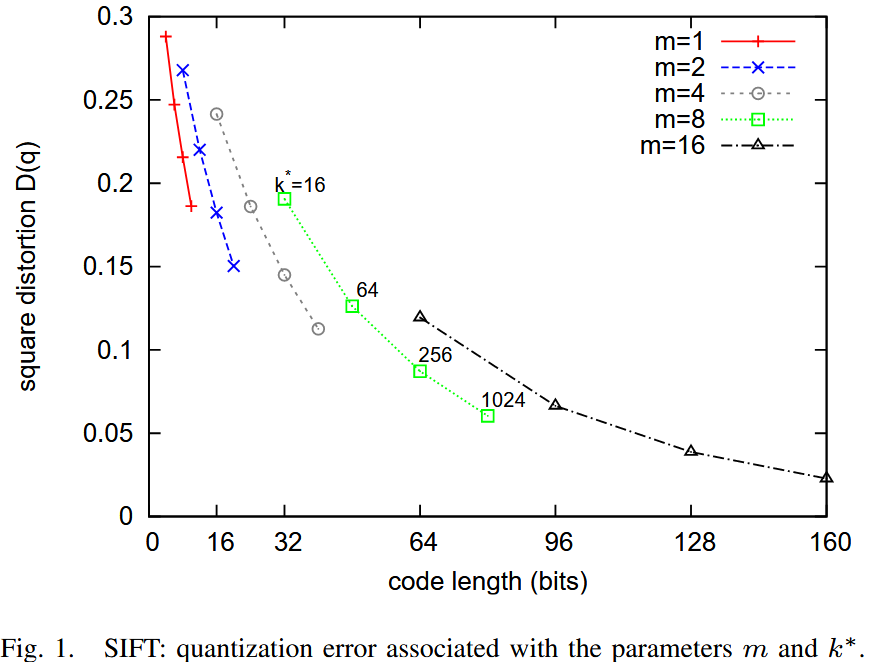
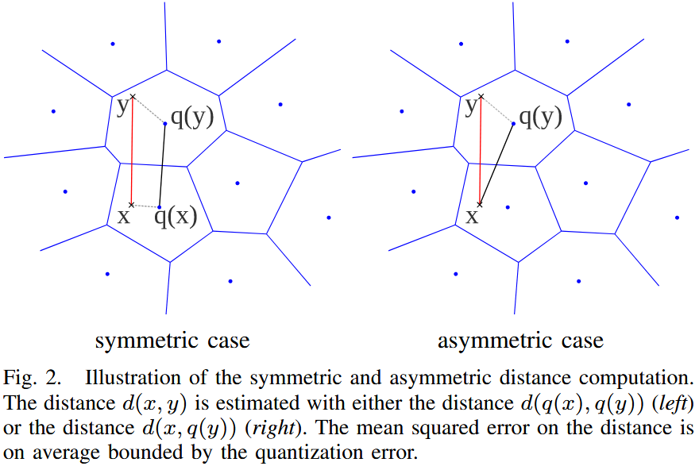
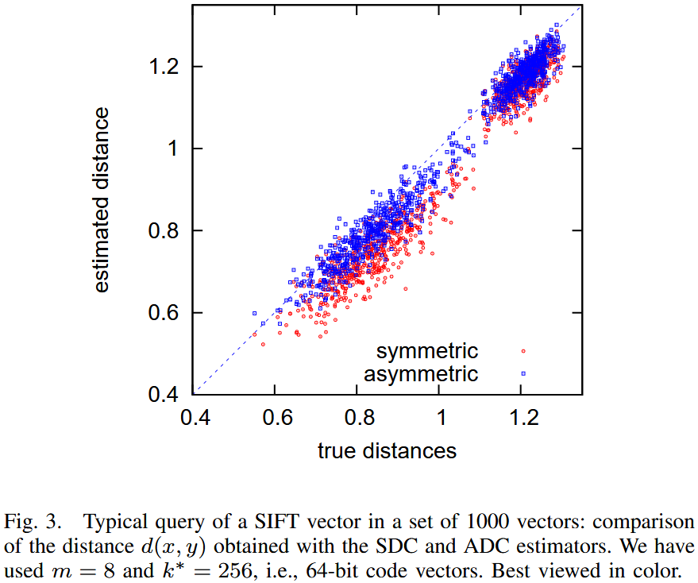
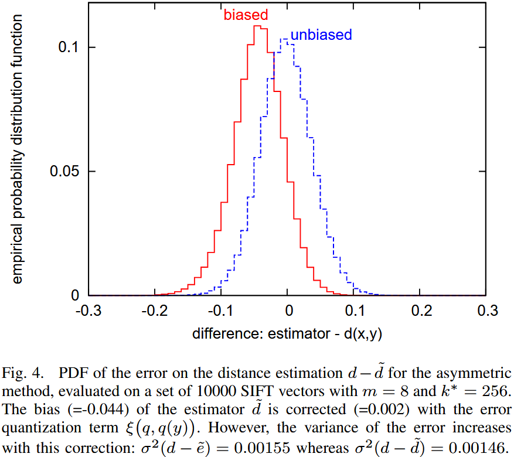

# Product Quantization for Nearest Neighbor Search
<!-- 
## Pretrain

- Clustering：

    以128维向量为例，首先指定一个参数M（例如4），表示将向量切分成M段。这样N个向量都被切成了4段的32维向量，以第一段的N个32维向量为例，做 Clustering 得到K个簇心（例如256，经验值）。
- Assign：

    把每一段的向量分配到最近的簇心，得到一个4维的索引，例如[0, 255, 78, 183]。

这样就完成了向量的压缩。

## Query

对于每一个查询向量，以相同的方法把128维分成4段32维向量，然后计算每一段向量与之前预训练好的簇心的距离，得到一个4*256的表。

所以在计算时只用查M次表，比如的库里的某个向量被量化成了[0, 255, 78, 183], 那么首先查表得到查询向量第一段子向量与其ID为0的簇心的距离，然后再查表得到查询向量第二段子向量与其ID为255的簇心的距离......最后就可以得到四个距离d1、d2、d3、d4，查询向量跟库里向量的距离d = d1+d2+d3+d4。 -->

全文字数: **{{ #word_count }}**

阅读时间: **{{ #reading_time }}**

## Notations

### Vector quantization

量化是一种破坏性（destructive）过程，其目的是减少表示空间的基数。形式上，一个**量化器（quantizer）** 是一个函数 \(q\)，它将一个 \(D\) 维向量 \(x \in \mathbb{R}^D\) 映射到一个向量 \(q(x) \in \mathcal{C} = \{c_i; i \in \mathcal{I}\}\)，其中索引集合 \(\mathcal{I}\) 现在假设是有限的，即 \(\mathcal{I} = 0 \dots k-1\)。**再现值（reproduction values）** \(c_i\) 被称为**质心（centroids）** 。再现值的集合 \(\mathcal{C}\) 被称为**码本（codebook）** ，其大小为 \(k\)。

映射到给定索引 \( i \) 的向量集合 \( \mathcal{V}_i \) 被称为 **（Voronoi）单元（cell）**，定义如下：
\[
\mathcal{V}_i \triangleq \{ x \in \mathbb{R}^D : q(x) = c_i \}.
\]
量化器的 \( k \) 个单元构成了 \( \mathbb{R}^D \) 的一个划分。根据定义，所有位于同一单元 \( \mathcal{V}_i \) 内的向量都由同一个质心 \( c_i \) 重构。量化器的质量通常通过输入向量 \( x \) 与其重构值 \( q(x) \) 之间的**均方误差（MSE, Mean Squared Error）** 来衡量：
\[
\text{MSE}(q) = \mathbb{E}_X \left[ d(q(x), x)^2 \right] = \int p(x) d(q(x), x)^2 dx,
\]

- \( d(x, y) = \| x - y \| \) 表示 \( x \) 和 \( y \) 之间的欧几里得距离
- \( p(x) \) 是对应于随机变量 \( X \) 的概率分布函数。

对于任意概率分布函数，通常使用**蒙特卡洛采样（Monte-Carlo sampling）** 进行数值计算，即在大量样本上计算 \( \| q(x) - x \|^2 \) 的平均值。

为了使量化器达到最优，它必须满足**Lloyd 最优条件（Lloyd optimality conditions）** 中的两个性质。

1. 向量 \( x \) 必须被量化为最近的码本质心，即在欧几里得距离意义下：
\[
q(x) = \arg \min_{c_i \in \mathcal{C}} d(x, c_i).
\]
因此，单元（cells）由**超平面（hyperplanes）** 划定。
1. 重构值必须是 Voronoi 单元内向量的期望值，即：
\[
c_i = \mathbb{E}_X [x \mid i] = \int_{\mathcal{V}_i} p(x \mid x \in \mathcal{V}_i) x \, dx.
\]

**Lloyd 量化器（Lloyd quantizer）** 对应于 k-means 聚类算法，它通过迭代的方式寻找近似最优的码本，不断地将训练集中向量分配给质心，并从这些分配的向量中重新估计质心。需要注意的是，k-means 只能找到局部最优解，而非全局最优解（就量化误差而言）。

**均方畸变（mean squared distortion）**  \( \xi(q, c_i) \)，描述了当一个向量被重构到所属单元 \( \mathcal{V}_i \) 的质心 \( c_i \) 时的误差。令：
\[
p_i = \mathbb{P}(q(x) = c_i)
\]
表示一个向量被分配到质心 \( c_i \) 的概率，则该误差的计算公式如下：
\[
\xi(q, c_i) = \frac{1}{p_i} \int_{\mathcal{V}_i} d(x, q(x))^2 p(x) \, dx.
\]
均方误差（MSE）可以由这些量计算得到：
\[
\text{MSE}(q) = \sum_{i \in \mathcal{I}} p_i \, \xi(q, c_i).
\]

### Product quantizers

**乘积量化（Product quantization）** 输入向量 \( x \) 被划分为 \( m \) 个不同的子向量 \( u_j \)，其中 \( 1 \leq j \leq m \)，每个子向量的维度为：

\[
D^* = D / m
\]

其中 \( D \) 是 \( m \) 的整数倍。这些子向量分别使用 \( m \) 个不同的量化器进行量化。因此，给定的向量 \( x \) 被映射如下：

\[
\underbrace{x_1, ..., x_{D^*}}_{u_1(x)}, ..., \underbrace{x_{D-D^*+1}, ..., x_D}_{u_m(x)} \rightarrow q_1(u_1(x)), ..., q_m(u_m(x)),
\]

其中 \( q_j \) 是与第 \( j \) 个子向量相关的低复杂度量化器。对于子量化器 \( q_j \)，关联索引集合 \( \mathcal{I}_j \)、码本 \( \mathcal{C}_j \) 以及对应的重构值 \( c_{j,i} \)。

乘积量化器的重构值由 乘积索引集合 的一个元素唯一标识：

\[
\mathcal{I} = \mathcal{I}_1 \times ... \times \mathcal{I}_m
\]

因此，码本定义为笛卡尔积：

\[
\mathcal{C} = \mathcal{C}_1 \times ... \times \mathcal{C}_m
\]

该集合的质心是 \( m \) 个子量化器的质心的串联。假设所有的子量化器都有相同的有限重构值数量 \( k^* \)，因此，总质心数为：

\[
k = (k^*)^m
\]

在极端情况下（当 \( m = D \)），向量 \( x \) 的每个分量都会被单独量化，此时 乘积量化器退化为标量量化器，其中每个分量的量化函数可能不同。

乘积量化器的优势在于可以通过多个小型质心集（子量化器的质心集合）来生成大规模质心集合。当使用 Lloyd 算法学习子量化器时，使用的样本数量有限，但码本仍然可以适应数据分布。

乘积量化器的学习复杂度是 \( m \) 倍于在 \( D^* \) 维度上进行 \( k^* \) 质心的 k-means 聚类的复杂度。

显式存储码本 \( \mathcal{C} \) 并不高效，因此我们只存储所有子量化器的 \( m \times k^* \) 个质心，即：

\[
m D^* k^* = k^* D
\]

个浮点值。量化一个元素需要 \( k^* D \) 次浮点运算。下表总结了 k-means、HKM 和乘积 k-means 的计算资源需求。乘积量化器 是唯一能在大 \( k \) 值时被索引存储于内存的方法。

| Method            | Memory Usage                                  | Assignment Complexity          |
|------------------|--------------------------------------------|------------------------------|
| k-means         | \( kD \)                                   | \( kD \)                     |
| HKM            | \( \frac{b_f}{b_f - 1} (k - 1) D \)        | \( lD \)                     |
| Product k-means | \( m k^* D^* = k^{1/m} D \)                | \( m k^* D^* = k^{1/m} D \)   |

为了保证良好的量化性能，在 \( k^* \) 取常数时，每个子向量应具有相近的能量。一种方法是在量化前用随机正交矩阵变换向量，但对于大多数向量类型来说，这并不需要，也不推荐，因为相邻分量通常由于构造上的相关性而更适合使用相同的子量化器量化。

由于子空间正交，乘积量化器的**平方畸变（Squared Distortion）** 可计算为：

\[
\text{MSE}(q) = \sum_j \text{MSE}(q_j)
\]

其中 \( \text{MSE}(q_j) \) 是与子量化器 \( q_j \) 相关的畸变。

下图  显示了 MSE 随代码长度变化的曲线，其中代码长度为：
\(
l = m \log_2 k^*
\),\(k^*\)是2的幂

可以观察到，在给定比特数的情况下，使用少量子量化器，但每个子量化器有更多质心，比使用多个子量化器但每个子量化器比特数较少要更好。

在极端情况下（当 \( m = 1 \)），乘积量化器退化为标准 k-means 码本。

高 \( k^* \) 值 会增加量化器的计算成本（如表 I 所示），同时也增加了存储质心的内存开销（即 \( k^* \times D \) 个浮点数）。如果质心查找表无法适应缓存，则效率会降低。

在 \( m = 1 \) 的情况下，为了保证计算开销可控，无法使用超过 16 位的编码。通常，选择 \( k^* = 256 \) 且 \( m = 8 \) 是一个合理的选择。

## Search

### Computing distances using quantized codes

假设有一个查询向量 \( x \) 和一个数据库向量 \( y \)。有两种方法来计算这些向量之间的**近似欧几里得距离**：**对称距离计算（SDC）** 和 **非对称距离计算（ADC）**。

**对称距离计算（Symmetric Distance Computation, SDC）：**  

在 SDC 方法中，查询向量 \( x \) 和数据库向量 \( y \) 均由其对应的质心 \( q(x) \) 和 \( q(y) \) 表示。因此，距离 \( d(x, y) \) 近似为：

\[
\hat{d}(x, y) \triangleq d(q(x), q(y))
\]

利用 乘积量化器，这个距离可以高效地计算为：

\[
\hat{d}(x, y) = d(q(x), q(y)) = \sqrt{\sum_j d(q_j(x), q_j(y))^2}
\]

其中，距离项 \( d(c_{j,i}, c_{j,i'})^2 \) 从查找表中读取，该查找表与第 \( j \) 个子量化器相关。每个查找表包含所有质心对 \((i, i')\) 之间的平方距离，即存储了 \( (k^*)^2 \) 个平方距离。

**非对称距离计算（Asymmetric Distance Computation, ADC）：**  

在 ADC 方法中，数据库向量 \( y \) 仍由其质心 \( q(y) \) 表示，但查询向量 \( x \) 不经过编码。因此，距离 \( d(x, y) \) 近似为：

\[
\tilde{d}(x, y) \triangleq d(x, q(y))
\]

其计算方式如下：

\[
\tilde{d}(x, y) = d(x, q(y)) = \sqrt{\sum_j d(u_j(x), q_j(u_j(y)))^2}
\]

其中，平方距离 \( d(u_j(x), c_{j,i})^2 \) 在搜索之前已经计算，其中 \( j = 1, ..., m \)，\( i = 1, ..., k^* \)。

在最近邻搜索中，实际上不会计算平方根，直接使用平方距离进行排序。

下表  总结了在数据集中搜索最近邻所涉及的不同步骤的复杂度。假设数据集 \( \mathcal{Y} \) 的大小为 \( n = |\mathcal{Y}| \)，可以看到 SDC 和 ADC 的查询准备成本是相同的，并且不依赖于数据集大小 \( n \)。

|                         | SDC          | ADC                     |
|-------------------------|-------------|-------------------------|
| Encoding \( x \)        | \( k^* D \)  | \( 0 \)                 |
| Compute \( d(u_j(x), c_{j,i}) \) | \( 0 \) | \( k^* D \)           |
| Compute \( \hat{d}(x, y) \) or \( \tilde{d}(x, y) \) | \( n m \) | \( n m \) |
| Find \(top-k\)| \( n + k \log k \log \log n \) | \( n + k \log k \log \log n \) |

当 \( n \) 很大（\( n > k^* D^* \)）时，计算量主要由求和运算决定。而搜索 \( k \) 个最小元素的复杂度 是对 \( n \gg k \) 的元素进行无序比较的平均复杂度。

**SDC 与 ADC 的对比**  

| |Pros|Cons|
|---|---|---|
|**SDC**|减少查询向量的内存开销|更高的距离畸变|
|**ADC**|更低的距离畸变|相对较高的查询向量内存开销|

在本文的剩余部分，将重点讨论 **ADC 方法**。

### Analysis of the distance error

分析使用 \( \tilde{d}(x, y) \) 代替 \( d(x, y) \) 所带来的距离误差。这一分析不依赖于乘积量化器，对满足 Lloyd 最优条件的任何量化器都适用。

在重构的均方误差（MSE）准则的基础上，距离畸变（distance distortion） 通过均方距离误差（MSDE） 来衡量：

\[
\text{MSDE}(q) \triangleq \iint (d(x, y) - \tilde{d}(x, y))^2 p(x) dx \, p(y) dy. 
\]

根据三角不等式，我们有：

\[
d(x, q(y)) - d(y, q(y)) \leq d(x, y) \leq d(x, q(y)) + d(y, q(y)).
\]

同样地，可以写成：

\[
(d(x, y) - d(x, q(y)))^2 \leq d(y, q(y))^2.
\]

可得：

\[
\text{MSDE}(q) \leq \int p(x) \left( \int d(y, q(y))^2 p(y) dy \right) dx.
\]

最终，我们得到：

\[
\text{MSDE}(q) \leq \text{MSE}(q).
\]

其中，\( \text{MSE}(q) \) 是与量化器 \( q \) 相关的均方误差。

该不等式适用于任何量化器，表明本方法的距离误差在统计意义上受量化器的 MSE 约束。

对于 对称版本（SDC），类似的推导表明其误差在统计上受 \( 2 \times \text{MSE}(q) \) 约束。因此，最小化量化误差（MSE）是重要的，因为它可以作为距离误差的统计上界。

如果在最高排名的向量上执行精确距离计算（如 局部敏感哈希（LSH）），那么量化误差可以用作动态选择需要后处理的向量集合的标准，而不是随意选择某一部分向量。

### Estimator of the squared distance

在本小节中，我们分析使用 \( \hat{d}(x, y) \) 或 \( \tilde{d}(x, y) \) 进行估算时，如何在平均意义上低估描述符之间的距离。

该图显示了在 1000 个 SIFT 向量数据集中查询一个 SIFT 描述符所得的距离估计。该图比较了真实距离与SDC与ADC计算出的估计值。可以清楚地看到，这些距离估计方法存在偏差（bias），且对称版本（SDC）更容易受到偏差的影响。

为了消除偏差，我们计算平方距离的期望值。在乘积量化方法中，一个给定向量 \( y \) 的近似值 \( q(y) \) 由其子量化索引 \( q_j(u_j(y)) \)（其中 \( j = 1, ..., m \)）获得。

量化索引标识了向量 \( y \) 所处的单元 \( \mathcal{V}_i \)。因此，可以计算期望平方距离 \( \tilde{e}(x, q(y)) \) 作为修正项：

\[
\tilde{e}(x, y) \triangleq \mathbb{E}_Y [(x - Y)^2 \mid q(Y) = c_i]
\]

\[
= \int_{\mathcal{V}_i} (x - y)^2 p(y \mid i) dy
\]

\[
= \frac{1}{p_i} \int_{\mathcal{V}_i} (x - c_i + c_i - y)^2 p(y) dy.
\]

根据Lloyd 最优条件有：

\[
\int_{\mathcal{V}_i} (y - c_i) p(y) dy = 0.
\]

因此可简化为：

\[
\tilde{e}(x, y) = (x - q(y))^2 + \int_{\mathcal{V}_i} (q(y) - y)^2 p(y \mid y \in \mathcal{V}_i) dy.
\]

\[
= \tilde{d}(x, y)^2 + \xi(q, q(y)).
\]

其中，\( \xi(q, q(y)) \) 代表了重构误差（distortion），即 \( y \) 由其重构值 \( q(y) \) 近似时的误差。

在乘积量化框架下，向量 \( x \) 与 \( y \) 之间的期望平方距离可以通过修正方程 (13) 计算：

\[
\tilde{e}(x, y) = \tilde{d}(x, y)^2 + \sum_j \xi_j(y).
\]

其中，修正项 \( \xi_j(y) \) 为第 \( j \) 个子量化器的平均畸变（distortion）：

\[
\xi_j(y) \triangleq \xi(q_j, q_j(u_j(y))).
\]

这些畸变值可以预先学习，并存储在查找表中，供量化索引 \( \mathcal{I}_j \) 使用。

对于 对称版本（SDC），即 \( x \) 和 \( y \) 均经过量化，类似的推导可以得到修正后的平方距离估计公式：

\[
\hat{e}(x, y) = \hat{d}(x, y)^2 + \sum_j \xi_j(x) + \sum_{j'} \xi_{j'}(y).
\]

**Discussion**
该图显示了真实距离与估计距离之间的概率分布。该实验基于大规模 SIFT 描述符数据集。

- 进行距离估计时，存在明显偏差。
- 采用 修正版本（，距离估计的偏差显著减少。

然而，修正偏差 会导致估计方差增大，这在统计学上是一个常见现象。此外，对于最近邻搜索而言：

- 修正项往往估计值更大，这可能会惩罚具有罕见索引的向量。
- 在 非对称版本（ADC） 中，修正项与查询 \( x \) 无关，只依赖于数据库向量 \( y \)。

在实验中，修正方法在整体上效果较差，因此，我们建议在最近邻搜索任务中使用原始版本，而修正版本仅在需要精准距离估计的任务中适用。

## Avoid exhaustive search

使用乘积量化器进行近似最近邻搜索非常高效（每次距离计算仅需 \( m \) 次加法运算），并且大大减少了存储描述符所需的内存。然而，标准搜索方法是穷举式（Exhaustive）的。

为了避免穷举搜索：

- 倒排文件系统（Inverted File System, IVF）
- 非对称距离计算（ADC）  

该方法称为 IVFADC。

传统倒排文件仅存储图像索引，而本文在此基础上增加了额外的编码，以便对每个描述符进行更精细的存储。使用乘积量化器对向量与其对应的粗质心之间的残差进行编码。  

- 显著加速搜索过程，代价仅是每个描述符存储额外的少量比特/字节。
- 提高搜索精度，因为对残差进行编码比直接编码向量本身更加精确。

### Coarse quantizer, locally defined product quantizer

---

> [Product Quantization for Nearest Neighbor Search](https://inria.hal.science/inria-00514462/file/jegou_pq_postprint.pdf)