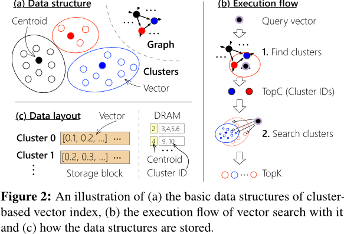

# Characterizing the Dilemma of Performance and Index Size in Billion-Scale Vector  Search and Breaking It with Second-Tier Memory

全文字数: **{{ #word_count }}**

阅读时间: **{{ #reading_time }}**

## Background

<!-- **Second-tier memory** (such as remote DRAM/NVM connected via RDMA or CXL), with its fine-grained access granularity, offers an effective solution to address **the mismatch between search and access granularity**.

However:
- Existing indexes, primarily designed for SSDs, do not perform well on second-tier memory.
- Second-tier memory behaves more like storage, making its use as DRAM inefficient.

To address this, the paper developed a graph and cluster index tailored to the performance characteristics of second-tier memory. 
- Optimal performance
- Orders of magnitude smaller index amplification. -->

**Second-tier memory**（如通过 **RDMA** 或 **CXL** 连接的远程 **DRAM/NVM**）具有 **细粒度的访问能力**，能够有效解决 **搜索粒度与访问粒度不匹配** 的问题。  

然而：  
- 现有索引主要针对 **SSD** 设计，在 **second-tier memory** 上表现不佳。  
- **Second-tier memory** 的行为更类似于存储，使其像 **DRAM** 那样使用时效率较低。  

为此，本文提出了一种专为 **second-tier memory** 性能特性优化的 **图索引与簇索引** 方案，具有以下优势：  
- **最优性能**  
- **数量级更小的索引放大**

## High Performance and Low Index Size Dilemma
<!-- 
Increasing index size improves performance:  
- For graph indexes, adding more edges reduces the number of jumps (I/O ).  
- For cluster indexes, duplicating neighboring vectors across clusters minimizes the number of clusters searched.  

Conversely, reducing index size leads to performance degradation. An alternative to reduce index size without altering the algorithm is to **copy addresses instead of duplicating vectors**. However, this introduces additional small random reads, which significantly degrade performance on SSDs.

**Root cause**: **Workload patterns do not align with SSD requirements.**
- SSD pages are typically 4KB, while second-tier memory supports access at a finer granularity of 256B.  
- Both graph and cluster indexes typically perform reads of a few hundred bytes at a time. -->

**增大索引大小可以提升性能**：  
- 对于 **图索引（graph indexes）**，增加更多的边可以减少跳数（I/O 操作）。  
- 对于 **簇索引（cluster indexes）**，在簇之间复制相邻向量可以减少搜索的簇数量。  

相反，**缩小索引大小会导致性能下降**。一种在不改变算法的情况下减少索引大小的替代方案是 **复制地址而不是重复存储向量**。然而，这种方法会引入额外的小随机读操作，在 **SSD** 上会显著降低性能。  

**根本原因**：**工作负载模式与 SSD 要求不匹配**  
- **SSD** 的页面通常为 **4KB**，而 **second-tier memory** 支持 **更细粒度的 256B 访问**。  
- **图索引和簇索引** 的读取操作通常仅涉及 **几百字节的数据**。

### Graph Index

<!-- 
- Graph indexes capture the fine-grained relationships between vectors, enabling low read amplification by accessing only a few additional vectors beyond the required top-k.  
- However, their pointer-chasing access pattern leads to high latency and poor bandwidth utilization.

DiskANN assigns 32 edges to each vector by default, with each edge represented as a 4B vector ID. This means the size of the edge list can exceed the size of the raw data. For example, representing a vertex with 100B in SPACEV requires 128B to store its edges.  

Ideally, the space amplification caused by edges should be minimized. However, reducing the number of edges increases the traversal distance for query vectors.  

Even if we increase the number of edges, the load per graph traversal remains limited by the SSD access granularity (4KB). Exceeding this would drastically inflate the index size—up to 39 times the size of the original dataset. For instance, storing a node with 100B while using 3,996B for edges leads to excessive space usage. -->

- **图索引（Graph indexes）** 能够捕捉向量之间的细粒度关系，使得在访问 **top-k** 以外的少量额外向量时，保持较低的读取放大（read amplification）。  
- 然而，其 **指针跳转（pointer-chasing）** 访问模式导致 **高延迟**，并且 **带宽利用率较低**。  

在 **DiskANN** 中，每个向量默认分配 **32 条边**，每条边由 **4B 向量 ID** 表示。这意味着边列表的大小可能会超过原始数据的大小。例如，在 **SPACEV** 中，一个大小为 **100B** 的顶点需要 **128B** 来存储其边信息。  

**理想情况下，边所引起的空间放大应尽可能减少**。然而，减少边的数量会增加查询向量的 **遍历距离（traversal distance）**。  

即使增加边的数量，每次图遍历的加载量仍然受限于 **SSD 的访问粒度（4KB）**。如果超出此限制，索引大小将急剧膨胀，甚至可能达到原始数据集大小的 **39 倍**。例如，一个 **100B** 的节点若使用 **3,996B** 存储边信息，将导致 **极高的空间占用**。

### Cluster Index

<!-- 
- Efficient for storage, enabling **large bulk reads** of clusters.  
- Suffer from high **read amplification** due to redundant vector reads within clusters.  
- Replications lead to high **space amplification**.

Ideally, cluster indexes should have a negligible index size:  
- The indexing data for clusters is several orders of magnitude smaller than the total dataset.  
- Each cluster may span multiple blocks, eliminating the need for padding.  

To address accuracy loss caused by boundary issues, boundary vectors are duplicated across adjacent clusters, requiring additional storage for the index.  

To reduce excessive duplication, an alternative is to increase the number of clusters searched per query. Unfortunately, additional cluster searches degrade performance due to the extra vectors read.  

Empirically, increasing the index size can still improve throughput. -->

- **存储效率高**，支持 **大批量读取（large bulk reads）** 簇数据。  
- 由于簇内存在冗余向量读取，导致 **高读取放大（read amplification）**。  
- **向量复制** 造成 **高空间放大（space amplification）**。  

**理想情况下，簇索引的大小应尽可能小**：  
- **簇的索引数据** 远小于整个数据集的规模，通常相差数个数量级。  
- **每个簇可能跨越多个块**，因此不需要填充（padding）。  

为了 **解决边界问题导致的准确率下降**，相邻簇之间会复制 **边界向量（boundary vectors）**，这需要 **额外的索引存储空间**。  

为 **减少过多的向量复制**，一种替代方案是 **增加每次查询搜索的簇数量**。但 **额外的簇搜索** 会导致 **额外的向量读取**，从而 **降低性能**。  

**经验上来看，增加索引大小仍然可以提升吞吐量（throughput）**。

## Workloads Mismatch SSD Requirements
<!-- 
- Graph index requires fine-grained storage reads for prac-tical index sizes.which  conflicts with the requirement of using a sufficiently large I/O payload(4 KB) to efficiently utilize traditional storage devices like SSD.
- Cluster index requires irregular I/O for deduplication.instead of storing replicated vector data in other clusters, we store an address pointing to the original cluster. the vector address(8 B) is significantly smaller than the data(128–384 B). However, it implies that each replicated vector requires a separate small random read(100–384 B) to fetch the original vector.  -->

- **图索引（Graph index）** 需要 **细粒度的存储读取** 以保持可接受的索引大小。然而，这与 **使用足够大的 I/O 负载（4 KB）** 来高效利用 **SSD 等传统存储设备** 的需求相冲突。  

- **簇索引（Cluster index）** 需要 **不规则 I/O** 来进行 **去重（deduplication）**。与其在其他簇中存储重复的向量数据，不如 **存储一个指向原始簇的地址**。**向量地址（8B）** 远小于实际数据（128–384B）。然而，这意味着每个被复制的向量都需要 **单独的小随机读（100–384B）** 来获取原始向量，进而影响读取性能。

**Power of Second-tier Memory**

<!-- - Fine-grained block sizes
    - utilize the device bandwidth more efficiently
- Robust to irregular I/O
    - replace (some) sequential accesses with random accesses -->

- **细粒度块大小（Fine-grained block sizes）**  
  - 更高效地利用设备带宽  

- **对不规则 I/O 具有更强的适应性（Robust to irregular I/O）**  
  - 将（部分）**顺序访问** 替换为 **随机访问**

## Improvement

### Graph Index
<!-- 
1. **Software Pipeline**: Upon issuing a second-tier memory request, the execution of the next unfinished query is scheduled immediately, enabling a pipelined approach to processing multiple queries at the software level for enhanced efficiency.  

2. **Compressed Layout**: DiskANN utilizes padding for storage; however, this design can lead to **4–44%** index space wastage. On **second-tier memory**, padding is unnecessary due to its robustness against **irregular I/O across block sizes**. Instead, a **Compressed Sparse Row (CSR) layout** is adopted, effectively reducing storage overhead while preserving performance. -->

#### Software Pipeline
在发出second-tier memory请求后，立即调度下一个未完成的查询执行，从而在软件层面以流水线方式高效处理不同的查询。  

#### Compressed Layout
DiskANN 采用填充方式进行存储，这种填充设计会浪费索引空间。在 **second-tier memory** 上，由于其能够有效适应 **跨块大小的不规则 I/O**，填充设计已无必要。因此直接选择 **压缩稀疏行（Compressed Sparse Row，CSR）** ，以减少存储空间占用，同时保持性能稳定。

### Cluster Index

#### Decoupled Layout
向量数据采用**独立存储**，而每个簇仅存储对应向量的**地址（b）**。这样，对于需要复制的向量，仅复制**地址**，而**无需复制向量本身**，从而有效减少存储开销。  

尽管**decoupled Layout**有助于**缩小索引大小**，但它将原本**0.1–2.2 MB** 的**顺序 I/O** 拆分为 **60–68 次小随机 I/O**（每次读取 100–384B）。更具体而言，工作负载中的 **98% I/O** 变成了**小随机读取**，而在 **second-tier memory** 上，这些 I/O 操作的效率同样不高。

#### Vector Grouping
为减少工作负载中的 **小 I/O 操作**，在 **decoupled design** 之上提出了 **向量分组（vector grouping）** 方法，以尽量减少 **小随机 I/O**。通过 **将同一簇的向量分组存储在相邻的存储位置**，可以使用 **一次大 I/O 操作** 读取整个分组的向量数据（见 **图 11(c)**）。**分组操作** 在 **索引构建后（post index build）** 进行。  

由于 **不复制向量**，必然会存在某些簇无法通过一次 I/O 读取其所有向量。因此，**分组的性能** 主要取决于 **向量如何被分组**。  

向量分组的目标是 **确定哪些向量应该被分组，以减少给定工作负载中的小 I/O**。这等价于 **向特定簇分配向量** 的问题。假设在一个向量数据库中，向量集合为 **V**，簇集合为 **C**，使用 **$P_{i,j}$** 表示 **第 i 个向量是否被分配到某个分组**。  

采用 **整数线性规划（Integer Linear Programming, ILP）** 来找到 **$P_{i,j}$ 的最优分组**，目标是 **最小化发往存储管理节点（MN）的 I/O 请求**。由于 I/O 数量取决于 **每个簇的访问频率**，我们使用 **$h_{j}$** 来表示 **簇 j 的访问频率**。  

这些频率可以通过 **后台监控工作负载** 获得，并可以根据 **访问频率的变化** 动态调整布局。

综合以上内容，问题可被公式化如下：  

$$ \text{min} \sum_{j}^{|C|} h_j \cdot \left(1 + \sum_{i}^{|V|} P_{i,j}\right) $$

**约束条件**：  
- **簇约束（Cluster constraints）**  
  根据簇索引设计，每个向量必须 **分配到一个簇**，但可以 **复制到多个相邻簇**。约束条件如下：  

  $$ \begin{cases}
  0 \leq A_{i,j} \leq 1, \quad i \in [0, |V|], j \in [0, |C|] \\
  \sum_{j}^{|C|} A_{i,j} \geq 1, \quad i \in [0, |V|]
  \end{cases} $$

- **分组约束（Group constraints）**  
  分组算法必须将 **一个向量分配给唯一的簇组**，约束如下：  

  $$
  \begin{cases}
  0 \leq P_{i,j} \leq 1, \quad i \in [0, |V|], j \in [0, |C|] \\
  \sum_{j}^{|C|} P_{i,j} = 1, \quad i \in [0, |V|]
  \end{cases}
  $$

## Conclusion
Second-tier memory is a promising storage medium for vector indexes.

> [Characterizing the Dilemma of Performance and Index Size in Billion-Scale Vector  Search and Breaking It with Second-Tier Memory](https://arxiv.org/abs/2405.03267)
